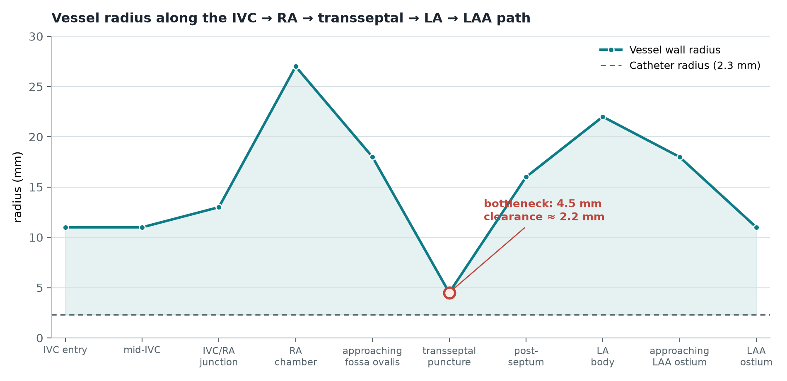

# LAAC Catheter Collision Simulation — Debug Log


Debug and tuning log for a continuum-mechanics catheter navigation prototype built on Unity + SOFA (BeamAdapter plugin), simulating delivery-sheath navigation for a Left Atrial Appendage Closure (LAAC) procedure: IVC → RA → transseptal puncture → LA → LAA ostium.

This is part of a larger personalized cardiac pre-op simulation project (federated learning + generative AI + AR surgical guidance). This repo covers just the catheter physics/collision piece, which turned out to need its own debugging session.

Vessel geometry here is an idealized generated tube (see [`generate_vessel_mesh.py`](#vessel-geometry)), not a patient CT segmentation. That comes later.

---

## What was broken

Console was flooded every frame with:

```
NullReferenceException: Object reference not set to an instance of an object
  at SofaUnity.SofaFEMForceField.Update_impl()
```

Turned out to be three unrelated infrastructure problems stacked on top of each other, plus the vessel mesh never actually rendering, plus a long tail of collision-tuning work once the scene finally ran. Wrote this down mostly so future-me doesn't repeat the same detours.

## Environment

| | |
|---|---|
| Engine | Unity 2022.3.46f1 |
| Physics | SOFA Framework via [InfinyTech3D SofaUnity](https://github.com/InfinyTech3D/SofaUnity) (v23.12), BeamAdapter plugin |
| Scene | `LAAC_Catheter_Demo.unity` |
| SOFA scene | `SofaScenes/LAAC_Catheter.scn` |
| Catheter model | Cosserat/Kirchhoff rod beam (Duriez, Cotin et al. 2006) |

---

## Restoring this project on a new machine

1. Install **Unity 2022.3.46f1** (exact version — matches `ProjectSettings/ProjectVersion.txt`).
2. Clone to an **ASCII-only path** (see §1.2 below for why — this isn't optional).
3. Open the project folder with that Unity version. First open will take a while: `Library/` isn't checked in (regenerable build cache, excluded via `.gitignore`), so Unity has to reimport every asset from scratch.
4. **Fix `sofa.ini` before pressing Play.** `Assets/SofaUnity/Core/Plugins/Native/x64/sofa.ini` has absolute paths baked in from the machine this was developed on:
   ```
   SHARE_DIR=D:/UnityProjects/LAAC_Catheter_Sim/Assets/SofaUnity/scenes/SofaScenes
   EXAMPLES_DIR=D:/UnityProjects/LAAC_Catheter_Sim/Assets/SofaUnity/scenes/SofaScenes
   LICENSE_DIR=D:/UnityProjects/LAAC_Catheter_Sim/Assets/SofaUnity/License/
   PYTHON_DIR=D:/UnityProjects/LAAC_Catheter_Sim/Assets/SofaUnity/Core/Plugins/Native/x64/
   ```
   If you cloned to that exact path, these are already correct. Anywhere else, replace `D:/UnityProjects/LAAC_Catheter_Sim` in each line with your actual project path — same fix as §1.2/§1.3 below, just relocated. Skipping this reproduces the original `Sofa plugin loading failed. Cause: file not found.` symptom even though the files are right there.
5. The 169 native DLLs (§1.1) are already included in this repo under `Core/Plugins/Native/x64/` — no separate download needed.

---

## 1. Three infrastructure failures under one symptom

Same call chain, three independent breaks. Fixing one just exposed the next.

### 1.1 Native plugin DLL missing

`SofaUnityAPI.SofaContextAPI` P/Invokes into `SAPAPI.dll`, which wasn't in the project at all — the InfinyTech3D package had been imported in its "no DLL" flavor. Log showed:

```
DllNotFoundException: SAPAPI assembly:<unknown assembly>
  at SofaUnityAPI.SofaContextAPI..ctor
```

Since `m_impl` never gets constructed, `SofaContext` never initializes, and every downstream component's `Update_impl()` — including `SofaFEMForceField` — runs against fields that were never set. Hence the NRE flood.

Fix: grabbed `SofaUnity_v23.12_windows_dll.zip` from the project's GitHub release (169 native DLLs) and dropped them into `Core/Plugins/Native/x64/`.

### 1.2 CJK characters in the project path

DLL loads fine now via .NET's P/Invoke marshaling (Unicode-safe), but SOFA's own internal file lookup — used for loading plugins and scene files — started failing with `Sofa plugin loading failed. Cause: file not found.` on files that demonstrably existed.

Root cause: the project lived under a path with a long run of Chinese characters. SOFA's native file-existence check isn't Unicode-safe on Windows (looks like it goes through the ANSI codepage rather than a wide-char API), so any path segment outside the current codepage silently breaks path resolution.

Fix: moved the whole project to an ASCII-only path. Problem disappeared entirely — not just for the plugin load, for every subsequent native file read in this project.

### 1.3 Wrong relative-path base in the `.scn`

```xml
<MeshOBJLoader filename="mesh/LAAC_Vessel/LAAC_vessel_path.obj" .../>
```

SOFA doesn't resolve relative paths against the `.scn` file's own directory — it resolves against the search-path list in `sofa.ini` (`SHARE_DIR`, `PYTHON_DIR`, etc.), none of which contain this subfolder. Changed to `../mesh/LAAC_Vessel/LAAC_vessel_path.obj` to match where the mesh generator actually writes the file.

---

## 2. Scene cleanup

Two more things that had nothing to do with collision but made the scene look broken.

**Leftover kidney demo assets.** This scene started life as a copy of the vendor's `KV1-Catheter.scn` (a kidney-stone/ureteroscopy demo, unrelated to cardiology). The `Organs` GameObject still had six vendor props under it — left/right kidney, aorta, liver, spine, body shell — that had nothing to do with LAAC. Removed via a one-shot editor script.

**Camera distance clamp.** `ThirdPersonCamera.cs`:

```csharp
m_cameraDistance = Mathf.Clamp(m_cameraDistance,
    m_cameraDistanceMin * m_currentScale,
    m_cameraDistanceMax * m_currentScale);
```

`m_currentScale` was `0.01`, capping the distance at `200`. The scene's geometry spans 300–400 units. Camera got clamped inside the mesh on every Play — looked like the screen tearing into fragments. Set `m_currentScale = 1` and re-pointed `m_lookAtStatic` at the vessel's actual bounding-box center once it existed.

---

## 3. The vessel mesh that was never actually there

This one took longest to track down because everything *looked* fine — no errors, the `.scn` loaded, `BeamAdapter.dll` loaded, catheter rendered. There was just nothing to collide with.

**Root cause**: `LAAC_Catheter.scn` defines `<Node name="LAAC_Vessel">` on the SOFA side, but the Unity-side mirror GameObject for it never existed. The scene had been produced by editing the `.scn` text directly (renaming the vendor's `Ureter` node to `LAAC_Vessel`) without ever re-running the "build GameObjects from SOFA graph" step in-editor. So on every Play:

1. SOFA loads the vessel geometry and collision natively — fine.
2. Unity's reconnect step looks for a GameObject whose recorded name matches a node in the *current* `.scn`. It doesn't find one for `LAAC_Vessel` (the old `Ureter` GameObjects are now orphans by name), so it prunes them.
3. Nothing new gets created. Physics may be running; nothing renders.

**Tried the "correct" fix first.** SofaUnity exposes `SofaContext.LoadSofaScene()` → `SofaDAGNodeManager.LoadNodeGraph()`, meant to rebuild the whole GameObject tree from the current `.scn`. It throws a `MissingReferenceException` partway through its own cleanup step (`ClearManager()`), on an already-corrupted leftover object. This looks like a pre-existing bug in the plugin, not something introduced here. Confirmed the crash happens before any save, so nothing got persisted — recovered by force-reopening the scene from disk.

**What actually worked**: copied the intact, still-working `Ureter` node subtree (29 objects: `MeshOBJLoader`, `MeshTopology`, three collision model types, and a `VesselVisu` child with `OglModel` + `IdentityMapping`) from the untouched sibling demo `BeamDemo_02_KV1.unity`, wrote a small script to parse both `.unity` YAML files, walk the object graph via `m_Component`/`m_Children`, assign fresh non-colliding fileIDs, and rename every `Ureter`/`UreterVisu`/`OglUreter` reference to `LAAC_Vessel`/`VesselVisu`/`OglVessel` (SOFA's reconnect logic matches by these exact name paths). Removed the corrupted leftovers, spliced the new subtree under the `root` node's transform.

Two self-inflicted bugs along the way, both caught before anything got saved in a broken state:

- Picked new fileIDs as `existing_max + offset`, except one leftover object in the target file happened to be sitting at the `int64` max value (`9223372036854775807`) — a sentinel from some earlier corruption — and the offset overflowed past it, producing an unparseable ID. Filtered the sentinel out of the max calculation.
- The file-rewrite logic only captured `--- !u!...` blocks and silently dropped the two header lines (`%YAML 1.1`, `%TAG !u! tag:unity3d.com,2011:`) that have to precede them. Unity loaded the result as an empty scene (0 root objects) until those got put back.

Verified with a clean Play session:

```
Renderer 'OglModel  -  OglVessel' enabled=True
bounds.center=(-137.56, 34.32, 42.18)  bounds.size=(276.39, 90.61, 112.75)
```

Zero NullReferenceExceptions for the rest of the session.

---

## 4. Collision tuning

Once the vessel actually rendered, the real problem showed up: the catheter tunnels through the wall under sustained input. Built a small runtime HUD (nearest-vertex approximation between catheter collision mesh and vessel mesh, not SOFA's internal contact distance, but close enough to see trends) to track this interactively instead of guessing from screenshots.

| # | Change | File | Symptom it targeted |
|---|---|---|---|
| 1 | `LCPConstraintSolver`: `tolerance` 1e-6 → 1e-4, `maxIt` 1000 → 2500 | `.scn` | Constant "no convergence in unbuilt nlcp gaussseidel function" warnings |
| 1 | `LocalMinDistance`: `alarmDistance` 2 → 3, `contactDistance` 0.1 → 0.4 | `.scn` | Tunneling everywhere |
| 2 | `InterventionalRadiologyController.step` 0.5 → 0.15 → 0.08 | `.scn` | Tunneling + violent snap-back on retraction |
| 2 | `LineCollisionModel`/`PointCollisionModel` `proximity` 0.0 → 1.0 → 1.8 | `.scn` | Catheter collision geometry was effectively a zero-thickness line |
| 2 | `alarmDistance` 3 → 5, `contactDistance` 0.4 → 0.5 | `.scn` | Same |
| 3 | `dt` 0.02 → 0.005 | `.scn` | Wall appeared to be skipped in a single frame before any contact registered |
| 4 | `EulerImplicitSolver`: added `rayleighStiffness=0.2`, `rayleighMass=0.2` | `.scn` | No damping on contact response → oscillation building up after impact |
| 5 | `SofaKeyEvent.cs`: `Input.GetKey()` fired once per rendered frame with no throttle | `.cs` | **Actual root cause of the "hold key → tunnel" behavior** — insertion speed scaled with framerate, completely decoupled from the physics solver |
| 6 | Rotation given its own, longer cooldown (0.12s vs. 0.04s for translation) | `.cs` | Sustained rotation swept the preformed-curve tip through the wall in an open chamber |
| 7 | `proximity` 1.0 → 1.8 (repeat of round 2, after ruling out timing) | `.scn` | Confirmed rotation tunneling isn't a rate problem; still occurs |

### Vessel geometry

Radius profile from [`generate_vessel_mesh.py`](Assets/SofaUnity/Scenes/Demos/Endoscopy/BeamAdapter/mesh/LAAC_Vessel/generate_vessel_mesh.py) — a Catmull-Rom spline through 10 control points, swept with a parallel-transport frame to avoid the usual Frenet-frame flips at inflection points.



Ran a curvature check (turn angle between consecutive path samples) independently of the radius data, and the sharpest bend in the entire 160-sample path lands at *t ≈ 0.53* — which is, unsurprisingly, the same point flagged above as the narrowest. Catheter radius is 2.3mm; net clearance at that point is about 2.2mm. Tightest curve and tightest radius, stacked at the same location, and it's also the anatomically hardest step of the real procedure (transseptal puncture). Mesh itself checked clean otherwise — ran a script over all 2560 vertices / 5088 faces: zero degenerate triangles, consistently inward-facing normals, no abnormal radius jump between adjacent rings (max ~0.8mm).

Widened that one point to 6.5mm temporarily (marked `TEMP` in the generator script) to isolate whether the rest of the path holds up on its own.

### Rotation tunneling — separate from everything above

In an open chamber (plenty of clearance by distance alone), holding the rotate key long enough still pushes the catheter through the wall. Confirmed it's not a rate/step-size issue — a single tap never triggers it, only sustained rotation does. The catheter tip has a preformed curve (`RodSpireSection`), so rotating it sweeps the tip through an arc; at some rotation angle that arc geometrically reaches the wall, and no amount of input throttling changes *whether* it eventually gets there, only how long it takes. Bumping collision `proximity` further didn't fix it either.

---

## Where this stands

- **Translation (advance/retract) tunneling**: mostly fixed. The narrow transseptal point is still the weak spot.
- **Rotation tunneling**: not fixed. Confirmed geometric (swept-arc reaches wall), not a solver-convergence or input-rate issue. Eight tuning rounds in, still occurs.
- Best read on this: we're close to the practical ceiling of discrete collision detection + LCP contact resolution for "thin curved rod sweeping past a thin shell." This exact failure mode is its own research topic in the surgical-sim literature (Duriez et al. 2006; Alderliesten et al. 2007), not something that falls out of parameter tuning.

**Next**: once the CT-reconstruction pipeline (Marching Cubes on patient DICOM) produces a real vessel mesh, a lot of the current edge cases tied to this idealized generated tube may just go away, or need re-evaluating against real anatomy. Diminishing returns on tuning the placeholder geometry further before that lands. Longer-term, actually fixing the rotation case would mean continuous collision detection or a dedicated broad-phase for swept/rotational motion — that's an algorithms project, not a config change.

---

## Files touched

```
Core/Plugins/Native/x64/*                              169 native DLLs added
Core/Plugins/Native/x64/sofa.ini                        local path correction
SofaScenes/LAAC_Catheter.scn                            all tuning above
LAAC_Catheter_Demo.unity                                cleanup, camera, vessel subtree
mesh/LAAC_Vessel/generate_vessel_mesh.py                transseptal radius 4.5→6.5 (TEMP)
mesh/LAAC_Vessel/LAAC_vessel_path.obj                   regenerated
Core/Scripts/Modules/Tools/SofaKeyEvent.cs              input throttling
Core/Scripts/Utils/CatheterWallDistanceHUD.cs           new — debug HUD
Assets/Editor/HudInjector.cs                            new — injects the HUD at runtime
```
